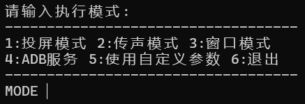
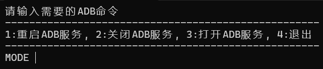
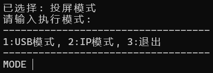

# Scrcpy 脚本 
## 1. 简介

当前版本 `scrcpy-AutoBAT_v2.2` `scrcpy_v3.2`

本项目暂时只针对 windows 平台进行设计。

虽然对于大部分人来说，QtScrcpy 等其他 GUI 版本的选择可能会是更好的选择。\
但这些 GUI 版本，通常更新慢于官方版本。

截止 **2024年12月10号**，Scrcpy 3.1 更新了虚拟屏幕使用，而 QtScrcpy 暂时更新至基于 Scrcpy 3.0.2 。
因此，我希望能够用简单的 **BAT文件** 来让 Scrcpy 的最新版本也可以随时能够正常使用。从而不依赖于 Scrcpy_GUI 版本的缓慢更新。

之后我也会尝试做一个只用于自动生成参数的GUI，以方便大家使用。


## 2. 安装

根目录下的 `scrcpy_download.bat` 是用于自动下载 `scrcpy-win64-v3.1.zip` 并自动解压。\
主程序如果检测到没有 `scrcpy_core` 目录，也会自动调用 `scrcpy_download.bat` 进行下载。\
需要注意的是如果手动更新了 `scrcpy` 也请放在 `scrcpy_core` 目录下。


## 3. 使用

选择对应语言的主程序 `scrcpy_start_cn.bat` 或 `scrcpy_start_en.bat` 进行使用。

### 模式选择

打开主程序后进入模式选择，有三种预设模式可选。



#### 投屏模式

常规镜像投屏模式。

#### 音频模式

只传输声音，选中 `Scrcpy 窗口`可以通过键鼠控制设备，按win键弹出开始菜单可返回PC。

#### 应用模式

此模式由 `Scrcpy_v3.1+` 支持。该模式可以在电脑中新建独立窗口以独立使用 APP 应用，而非镜像手机屏幕。该模式下，手机屏幕显示内容与电脑映射的手机内容是分开的。

但如果在不同窗口中同时打开相同的 APP 应用，则可能会导致部分窗口出错无法正常运行。

注意，该功能可能需要依赖于第三方启动器软件的支持。默认为 [Fossify](https://github.com/FossifyOrg/Launcher) (org.fossify.home) 开源安卓启动器。

将等号后面的参数修改为对应启动器的包名。

#### ADB服务



用于启动或关闭 ADB 服务，可以在链接存在错误时使用。或者用于关闭已建立的连接。

---

### 连接模式



选择 `通过 USB 直连` / `通过 IP 连接` \
在 BAT 脚本运行过程中，会提示输入模式选择。 \
可选 USB 直连或者通过网络 IP 进行连接。

如果选择 IP 模式，则会优先自动用 USB 调试获取 IP 地址进行连接。\
如果该过程失败则会提示手动输入 IP 地址及端口。


### 快捷键

详细请参考 [Scrcpy 快捷键](https://github.com/Genymobile/scrcpy/blob/master/doc/shortcuts.md)
默认使用 lalt 按键作为功能键


## 4. 配置

这里简单解释我在各模式默认添加的默认参数 \
自定义参数参考 [Scrcpy 说明文档](https://github.com/Genymobile/scrcpy/tree/master/doc)

```ini
[NORM_SET]
screen_off_timeout=300      //自动息屏时间
shortcut_mod=lalt           //功能键设置
resolution=864x1920         //新屏幕分辨率设置
max_size=1920               //串流分辨率设置
app_start_num=1             //默认的应用启动序号
custom_param=               //自定义参数
[CONN_SET]
device_ip=                  //最近一次IP地址保存
device_port=5555            //最近一次IP端口保存
[USB_SET]
usb_video_codec=h264        //USB模式-视频编码器
usb_video_buffer=50         //USB模式-视频缓冲数值，越小延迟越低，越大则越稳定
usb_max_fps=90              //USB模式-最大帧率
usb_audio_codec=opus        //USB模式-音频编码器
usb_audio_buffer=50         //USB模式-音频缓冲
[IP_SET]
ip_video_codec=h265         //IP模式-视频编码器
ip_video_buffer=80          //IP模式-视频缓冲数值，越小延迟越低，越大则越稳定
ip_max_fps=60               //IP模式-最大帧率
ip_audio_codec=opus         //IP模式-音频编码器
ip_audio_buffer=80          //IP模式-音频缓冲
[APP_List]
app_1=org.fossify.home      //应用0~9号应用
app_2=                      //输入包名
app_3=                      //在应用模式下选择对应的应用
app_4=
app_5=
app_6=
app_7=
app_8=
app_9=
app_0=
[END]
```


## 5. 鸣谢

基于 [Scrcpy](https://github.com/Genymobile/scrcpy) & [Fossify](https://github.com/FossifyOrg/Launcher) 软件

---
