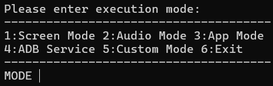
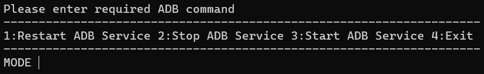
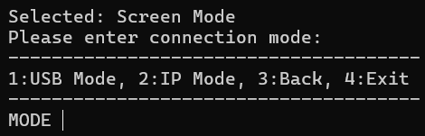

# Scrcpy Script

## 1. Introduction [中文](README.md) | English

English version is translated by AI.

Current version: `scrcpy-AutoBAT_v2.1` `scrcpy_v3.1`

This project is currently only designed for the Windows platform.

Although GUI versions like QtScrcpy may be a better choice for most users, these GUI versions are usually updated slower than the official version.  
As of **December 10, 2024**, Scrcpy 3.1 introduced virtual display support, while QtScrcpy is still based on Scrcpy 3.0.2.  
Therefore, I created a simple **BAT script** to ensure that the latest version of Scrcpy can always be used without relying on the slower updates of GUI versions.

In the future, I also plan to develop a GUI tool specifically for automatically generating parameters, making it easier for everyone to use.


## 2. Installation

The `scrcpy_download.bat` in the root directory is used to automatically download `scrcpy-win64-v3.1.zip` and extract it.  
If the main program detects that the `scrcpy_core` directory is missing, it will automatically call `scrcpy_download.bat` to download the required files.  

**Note:** If you manually update Scrcpy, please place the updated files in the `scrcpy_core` directory.


## 3. Usage

Run the main program `scrcpy_start_cn.bat` (for Chinese) or `scrcpy_start_en.bat` (for English) to start using it.

### Mode Selection

After launching the main program, you will enter the **mode selection menu**, which provides the following three modes:



#### **Mirroring Mode**

The standard screen mirroring mode.

#### **Audio Mode**

Only transmits audio.  
In this mode, selecting the Scrcpy window allows you to control the device using the keyboard and mouse. Pressing the **Windows key** will open the start menu and return to the PC interface.

#### **Application Mode**

This mode is supported starting from **Scrcpy 3.1+**.  
It allows you to create an independent window on your computer to run a specific app, rather than mirroring the entire phone screen.  

In this mode, the phone's display and the mirrored content on the computer are separate.  
**Note**: Opening the same app in multiple windows may cause errors, making some windows unable to run properly.  

Additionally, this feature may require third-party launcher software.  
By default, the program uses the open-source Android launcher [Fossify](https://github.com/FossifyOrg/Launcher) (`org.fossify.home`).  
You can change the parameter value to specify the package name of a different launcher.

#### **ADB Service**



This feature allows you to start or stop the ADB service.  
It can be used to troubleshoot connection errors or terminate established connections.

---

### Connection Modes



You can choose between **USB connection** or **IP connection**.  
During the BAT script execution, you will be prompted to select a connection mode:  

- **USB Connection**: Connect directly via USB cable.  
- **IP Connection**: Connect via the device's IP address.  

When using **IP mode**, the script will first attempt to retrieve the device's IP address using USB debugging.  
If this process fails, you will be prompted to manually input the IP address and port.

---

### Shortcuts

For detailed shortcuts, please refer to the official [Scrcpy Shortcuts](https://github.com/Genymobile/scrcpy/blob/master/doc/shortcuts.md).  
By default, the **`lalt`** key is used as the modifier key for shortcuts.


## 4. Configuration

Below is a simple explanation of the default parameters added for each mode.  
For custom parameters, refer to the official [Scrcpy Documentation](https://github.com/Genymobile/scrcpy/tree/master/doc).

```ini
[NORM_SET]
screen_off_timeout=300      // Auto screen-off timeout
shortcut_mod=lalt           // Modifier key for shortcuts
resolution=864x1920         // New screen resolution
max_size=1920               // Stream resolution
app_start_num=1             // Default app start index
custom_param=               // Custom parameters
[CONN_SET]
device_ip=                  // Last saved IP address
device_port=5555            // Last saved IP port
[USB_SET]
usb_video_codec=h264        // USB mode - video codec
usb_video_buffer=50         // USB mode - video buffer (lower = less delay, higher = more stable)
usb_max_fps=90              // USB mode - max frame rate
usb_audio_codec=opus        // USB mode - audio codec
usb_audio_buffer=50         // USB mode - audio buffer
[IP_SET]
ip_video_codec=h265         // IP mode - video codec
ip_video_buffer=80          // IP mode - video buffer (lower = less delay, higher = more stable)
ip_max_fps=60               // IP mode - max frame rate
ip_audio_codec=opus         // IP mode - audio codec
ip_audio_buffer=80          // IP mode - audio buffer
[APP_List]
app_1=org.fossify.home      // App 0~9 (package names)
app_2=                      // Specify package name here
app_3=                      // For app mode, choose the app to open
app_4=
app_5=
app_6=
app_7=
app_8=
app_9=
app_0=
[END]
```


## 5. Acknowledgments

Based on [Scrcpy](https://github.com/Genymobile/scrcpy) & [Fossify](https://github.com/FossifyOrg/Launcher)  

--- 
